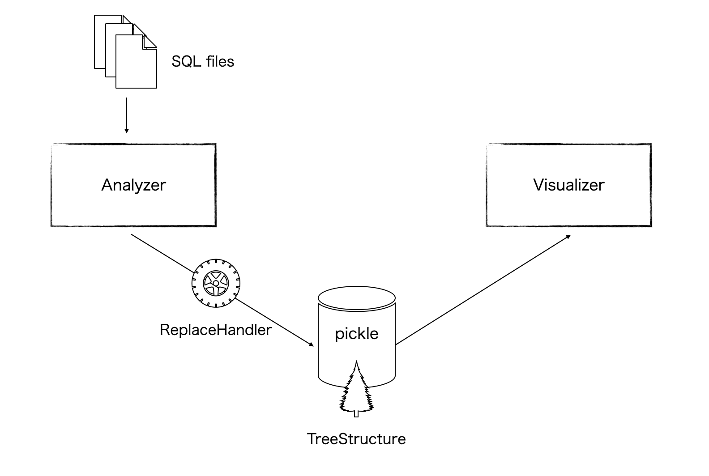

# datalineage-analyzer

## Overview
This tool explores SQL files, analyzes the lineage of data, and displays it.  
The structure is shown below.



1. The analyzer searches the SQL file.  
2. Convert vendor-specific processing in the SQL file.  
   There is a general-purpose conversion mechanism called ReplaceHandeler.  
3. Generates a tree-structured data structure and outputs it to a file (pickle format).
4. Output the tree structure in text format with visualizer.  


> + The current feature is for tables.  
> + The sqllineage is an all-in-one software that handles everything from data system analysis to display. However, it may not be possible to display when the table relationships are complicated and deep. This software uses sqllineage only for SQL parsing and is structured and displayed independently.

## Software requirements
* [sqllineage](https://github.com/reata/sqllineage)
* [treelib](https://github.com/caesar0301/treelib)


## Install packages  
```
pip install -r requirements.txt
```

## Execution example  
We will use the attached sample SQL as an example.  

Search and generate pkl file:
```
python analyzer.py -i sample
```
A data_lineage.pkl file is generated.  

Shows the table in which persons are used:
```
python visualizer.py -k target -t persons
```

output:
```
persons
├── city_stat
└── members
    └── address_stat
```

Shows the table from which members are based:
```
python visualizer.py -k source -t members
```

output:
```
members
├── address_of_member
└── persons
```

